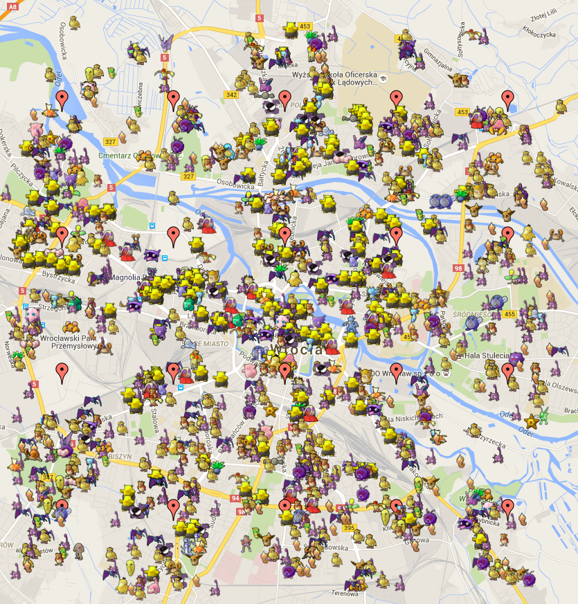

# pokeminer

Pokemon Go scraper. Based on an early version of [AHAAAAAAA/PokemonGo-Map](https://github.com/AHAAAAAAA/PokemonGo-Map).

## Oh great, another map?

This is not just a map. Apart from much cleaner codebase that suits my needs better, the `example.py` has been split into two entities: `worker.py` and `web.py`.

## So what's this for?

This tool (or more importantly, `worker.py`) gets rectangle as a start..end coordinates (configured in `config.py`) and spawns *n* workers. Each of the worker uses different Google/PTC account to scan its surrounding area for Pokemon. To put it simply: **you can scan entire city for Pokemon**. All gathered information is put into a database for further processing (since servers are unstable, accounts may get banned, Pokemon disappear etc.). `worker.py` is fully threaded, waits a bit before rescanning, and logins again after 10 scans just to make sure connection with server is in good state.

And `web.py`? It's just a simple interface for gathered data that displays active Pokemon on a map.

Here it is in action:



## Bulletpoint list of features

- multithreaded
- multiple accounts at the same time
- able to map entire city in real time
- data gathering for further analysis
- visualization

## Running

The only parameter worker accepts is *step limit*, just as in `example.py`.

```
python worker.py -st 8
```

To run interface:

```
python web.py --host 127.0.0.1 --port 8000
```

## Configuration

You need to have at least *rows* x *columns* accounts. So for below example, you need to have 20 accounts.

```py
DB_ENGINE = 'sqlite:///db.sqlite'  # anything SQLAlchemy accepts
MAP_START = (12.3456, 14.5)  # top left corner
MAP_END = (13.4567, 15.321)  # bottom right corner
GRID = (4, 5)  # row, column

ACCOUNTS = [
    # username, password, service (google/ptc)
    ('trainer1', 'secret', 'google'),
    ('trainer2', 'secret', 'ptc'),
    ('trainer3', 'secret', 'google'),
    # ...
]
```

### Setting up database

Run python REPL and:

```python
import db
db.Base.metadata.create_all(db.get_engine())
```

## License

See [LICENSE](LICENSE).
