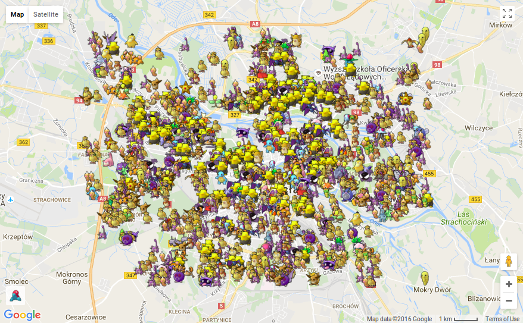
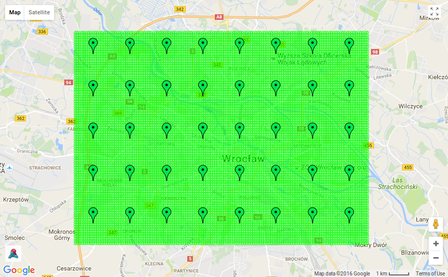

# pokeminer

Pokemon Go scraper capable of scanning large area for Pokemon spawns over long period of time. Suitable for gathering data for further analysis.

Based on an early version of [AHAAAAAAA/PokemonGo-Map](https://github.com/AHAAAAAAA/PokemonGo-Map), currently it uses [tejado/pgoapi](https://github.com/tejado/pgoapi).

## Oh great, another map?

This is not *a map*. Yeah, map is included, but main goal of this app is to *gather data* and put it in the database for further analysis. There are several other projects (including aforementioned PokemonGo-Map) that do better job at being just a map.

## How does it work?

`worker.py` gets rectangle as a start..end coordinates (configured in `config.py`) and spawns *n* workers. Each of the worker uses different Google/PTC account to scan its surrounding area for Pokemon. To put it simply: **you can scan entire city for Pokemon**. All gathered information is put into a database for further processing (since servers are unstable, accounts may get banned, Pokemon disappear etc.). `worker.py` is fully threaded, waits a bit before rescanning, and logins again after X scans just to make sure connection with server is in good state. It's also capable of restarting workers that are misbehaving, so that data-gathering process is uninterrupted.

There's also  a simple interface for gathered data that displays active Pokemon on a map. It can generate nicely-looking reports, too.

Here it is in action:



And here are workers together with their area of scan:



## Bulletpoint list of features

- multithreaded, multiple accounts at the same time
- aims at being very stable for long-term runs
- able to map entire city (or larger area) in real time
- data gathering for further analysis
- visualization
- reports for gathered data

## Setting up

[/u/gprez](https://www.reddit.com/u/gprez) made [a great tutorial on Reddit](https://www.reddit.com/r/pokemongodev/comments/4tz66s/pokeminer_your_individual_pokemon_locations/d5lovb6). Check it out if you're not accustomed with Python applications.

Create the database by running Python interpreter. Note that if you want more than 10 workers simultaneously running, SQLite is probably not the best choice.

```py
$> python
Python 2.7.10 (default, Jan 13 2016, 14:23:43)
[GCC 4.8.4] on linux2
Type "help", "copyright", "credits" or "license" for more information.
>>> import db
>>> db.Base.metadata.create_all(db.get_engine())
```

Copy `config.py.example` to `config.py` and modify as you wish. See [wiki page](https://github.com/modrzew/pokeminer/wiki/Config) for explanation on properties.

Run the worker:

```
python worker.py
```

Optionally run the live map interface and reporting system:

```
python web.py --host 127.0.0.1 --port 8000
```

## Reports

There are two reports:

1. Overall report, available at `/report`
2. Single species report, available at `/report/<pokemon_id>`

Here's how the overall report looks like:

[](http://i.imgur.com/Yy4VTq0.jpg)

## License

See [LICENSE](LICENSE).
