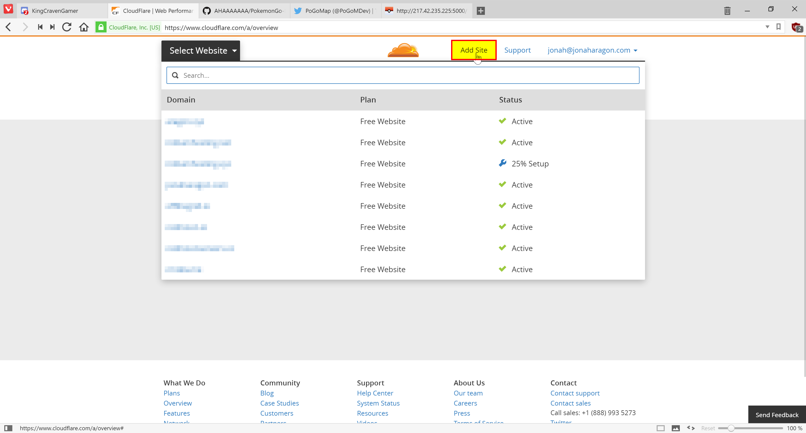
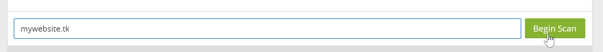
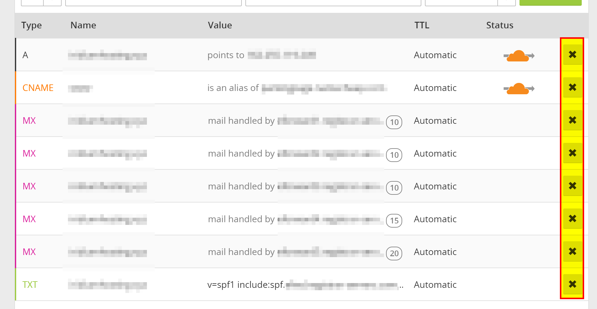
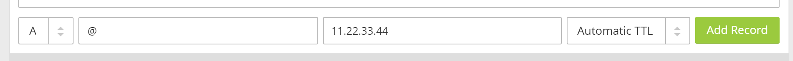
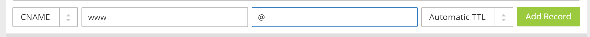
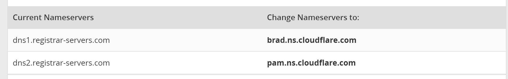

# CloudFlare

## Prerequisites

  - A domain name (free ones can be had from places like Freenom)
  - Your server [port forwarded](external.md) and **running on Port 80**

## Getting Started

First, sign up for an account at [cloudflare.com](https://www.cloudflare.com/a/sign-up). Get signed in and click "Add Site" at the top of the page to get started.

Enter your website in the text field and press "Begin Scan," when that finishes click Continue Setup next to your Domain.

If there is already information in this table, click the "X"s to clear them all out unless you already know what they are.

When the information is cleared, add two new records with the text boxes at the top with the following configuration:

They should be added in the table automatically when you press "Add Record." **Make sure they have the Orange Cloud next to them** to stay secure. When this is done, press "Continue" at the bottom of the page. On the next page select the "Free Website" option if it isn't already preselected and "Continue" again.

Now it will give you two Nameservers on a page similar to this (although yours will most likely be different). Copy both the bold ones and put them in your domain settings at your registrar.

Instructions to change your nameservers differ between domain registrars, here's instructions for a few common ones:

  - [Namecheap](https://www.namecheap.com/support/knowledgebase/article.aspx/767/10/how-can-i-change-the-nameservers-for-my-domain)
  - [GoDaddy](https://www.godaddy.com/help/set-custom-nameservers-for-domains-registered-with-godaddy-12317)
  - [Freenom](https://my.freenom.com/knowledgebase.php?action=displayarticle&id=3)

Once you have them set, navigate back to CloudFlare and press the Green Continue button once more, and you should be set! It may take **up to** 24 hours for it to switch to CloudFlare, but most of the time it happens much faster than that.

While we wait for it to switch, we should change some settings.

## Settings to Change

Click the "Crypto" tab at the top and change SSL from Full to Flexible if it isn't already.

Navigate to "Firewall" and change "Security Level" to "High." If you are running this from your house consider setting it to "I'm under attack" for the highest amount of DDoS security against your server.

## Finishing Up

Everything should not be configured correctly! Simply visit `http://yourdomain.com/` in your browser and your map should load, all while hiding your IP address from everybody else.
