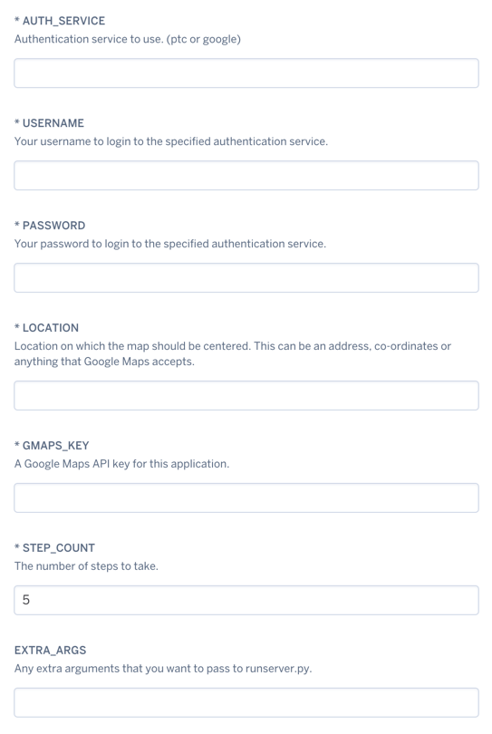
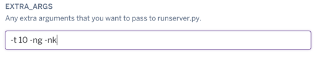

# Heroku

[](https://dashboard.heroku.com/new?button-url=https://github.com/AHAAAAAAA/PokemonGo-Map/tree/develop&template=https://github.com/AHAAAAAAA/PokemonGo-Map/tree/develop)

This project supports deploying a new app to Heroku using the "Deploy to Heroku" button.  Clicking this button will walk you through setting up the project on your Heroku account, allowing you to set the various configuration values required to make the project run.



## Making use of the EXTRA_ARGS when setting up a Heroku app

To enable non-standard configuration options, you'll want to utilize the `EXTRA_ARGS` field.

This field accepts any command line configuration parameters defined on the [Usage](Usage.md) page:

*EX: Use 10 threads, Exclude Gyms, Exclude PokéStops:* `-t 10 -ng -nk`



**But what if my project has already been deployed?**
 * Click `Settings` > `Reveal Config Vars`
 * At the bottom of the list, add a new "KEY" titled `EXTRA_ARGS`
 * The "VALUE" field is where you will add your configuration arguments:
 * *EX: Use 10 threads, Exclude Gyms, Exclude PokéStops:* `-t 10 -ng -nk`
 * 

## Manually deploying to Heroku

To manually deploy this app to Heroku, perform the following steps:

1. Get a local copy of the project

   ```
   git clone https://github.com/AHAAAAAAA/PokemonGo-Map.git`
   ```

2. Create a Heroku app for the project

   ```
   heroku create insertyourappname`
   ```

3. Set the required configuration parameters for the app, replace with your actual values.

   ```
   heroku config:set AUTH_SERVICE=insertyourauthservicehere
   heroku config:set USERNAME=insertyourusernamehere
   heroku config:set PASSWORD=insertyourpasswordhere
   heroku config:set LOCATION=insertyourlocationhere
   heroku config:set STEP_COUNT=insertyourstepcounthere
   heroku config:set GMAPS_KEY=inseryourgmapskeyhere
   heroku config:set EXTRA_ARGS=optional_extra_arguments
   ```

4. Push the project develop branch to the master branch on Heroku

   ```
   git checkout develop
   git push heroku develop:master
   ```

All set, have fun!