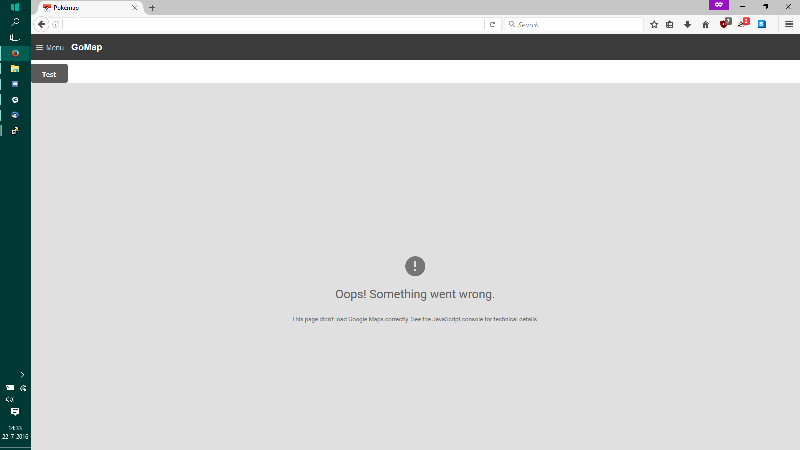
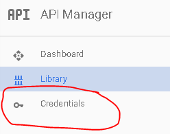
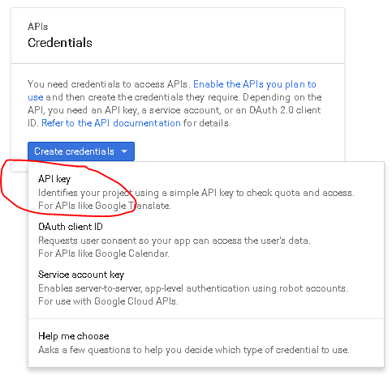
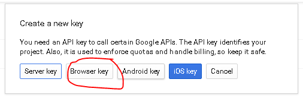

# Google Maps Key

This project uses Google Maps. There's one map coupled with the project, but as it gets more popular we'll definitely hit the rate-limit making the map unusable.

## Common error

## How to fix

1. Go to [Google API Console](https://console.developers.google.com/)

2. If it's the first time, click 'Next' on a bunch of pop-ups or just click somewhere where the pop-ups aren't

3. Create Credentials

   
   - Select a project: Create a project
   - Project name: Anything you want
   - Yes/No for email
   - Yes to agree to ToS
   - Click create.

4. Get your API Key
   - Click on Credentials again
   - Click Create -> API
   - Choose 'Browser Key'
   - Click 'Create' and then copy the API Key somewhere
   
   

5. Enable two Google Maps APIs
   - Google Maps Javascript API - Enables Displaying of Map
     - Click on 'Library'
     - Click on Google Maps Javascript API
     - Click 'ENABLE'
   - Google Places API Web Service - Enables Location Searching
     - Click on 'Library'
     - Type 'Places' into the search box ' Search all 100+ APIs'
     - Choose Google Places API Web Service
     - Click 'ENABLE'

## Configuration of API Key

1. Navigate to your pokemon map directory, and inside the config folder you will find config.ini.
2. Add your previously created Google API key in this file, save it, and re-run the server! it should be working now! If you see an error, make sure you actually enabled the Javascript API in Step 5.
