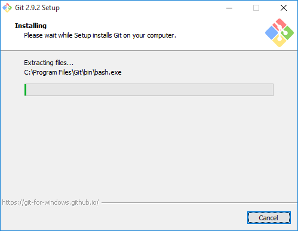
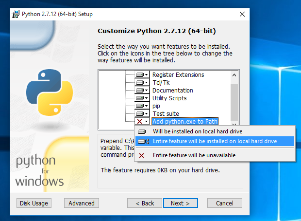
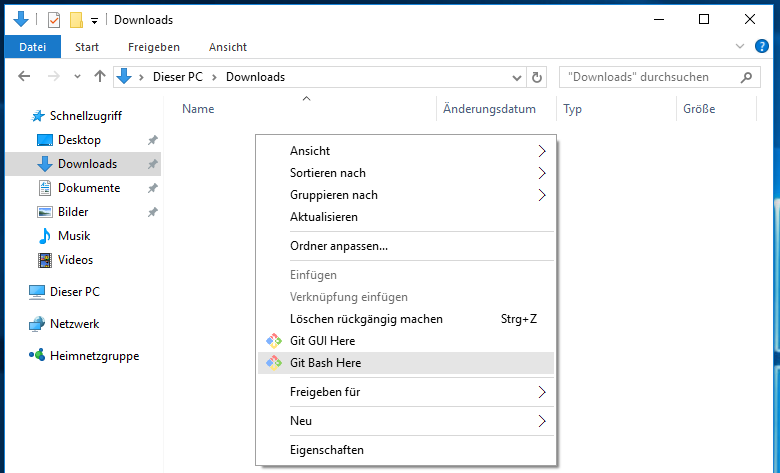
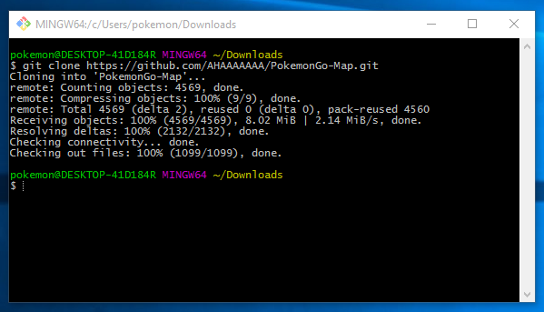
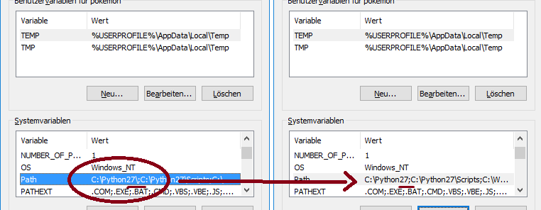
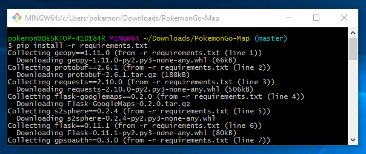
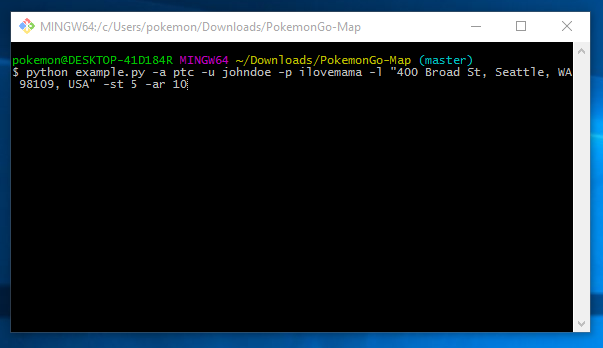
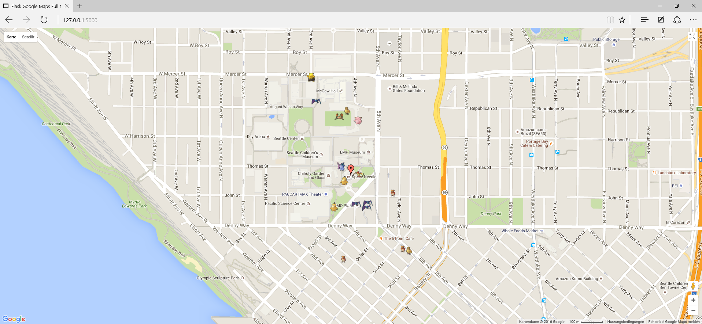

# Windows Install

In order to run the project, you will need Python, pip and the project dependencies.

## Prerequisites

  - [git for windows](https://git-for-windows.github.io/)
  - [Python 2.7.1.2](https://www.python.org/downloads/release/python-2712/)
  - [Microsoft Visual C++ Compiler for Python 2.7](https://www.microsoft.com/en-us/download/details.aspx?id=44266)

## Known Issues

- If you are having Issues with Step 6 and did not install Python on your C: drive, try uninstalling and reinstalling Python on C: before opening an issue (thanks @[RicarFox](https://github.com/RicarFox/)).

## Step 1: Install Git for Windows
Download Git for Windows from the link above and install it. You will be fine with all recommended options during the setup.

## Step 2: Install Python

**Note**: If you already have another version of Python installed, you probably want to uninstall that version and install 2.7.1.2. I did not test this setup with any other version.

Download Python 2.7.1.2 either as the 64bit or the 32bit version from the link above. **Make sure** to add Python to PATH during the setup (see screenshot)!

## Step 3: Clone PokemonGo-Map

Navigate to the folder you want to download PokemonGo-Map to. For this guide we'll be using the Downloads folder. Rightclick inside the folder and select *Git Bash Here* from the context menu.

You can copy the following command and paste it with a rightclick into the shell window that has opened:

`git clone https://github.com/AHAAAAAAA/PokemonGo-Map.git`

Now we have all PokemonGo-Map files inside our Downloads folder.

## Step 4: Get your own Google Maps API Key

Go to [this page](https://console.developers.google.com/flows/enableapi?apiid=maps_backend,geocoding_backend,directions_backend,distance_matrix_backend,elevation_backend,places_backend&keyType=CLIENT_SIDE&reusekey=true) to get your own Google Maps API Key. If you do not get your own API Key, you'll very likely run into an error telling you that you reached the daily request limit.

If you got your own API Key, rename *config.ini.example* to *config.ini* file inside the *PokemonGo-Map/config* folder. You can edit that file with Windows' built in text editor. Now replace the API Key under #Misc with the one you got from that Google website. Make sure you remove the # before any line you want to use.

## Step 5: Fix Python Path

> This step is not needed on every system, but it's probably good to check if everything is set up correctly.

First things first. Press `WindowsKey + PAUSE` on your keyboard and select *Advanced System Settings* from the left side menu. At the bottom of that windows click *Environment Variables*. In my case the Python value for the Path variable was set to `C:\Python27\;` which is wrong. You have to remove final backslash if that's the case for you too. If you're having issues with this feel free to open an Issue.

## Step 6: Setup PokemonGo-Map

That was the hard part. Now navigate to the PokemonGo-Map folder and *Git Bash Here*, like in Step 3. Now paste this command:

`pip install -r requirements.txt`

###Develop branch only instructions

In order for the map to load on the develop branch, there are some additions requirements.

1. Install node.js. That will install the `npm` command.
  -[Node.js 6.3.1] (https://nodejs.org/dist/v6.3.1/node-v6.3.1-x64.msi)
2. Open an *admin* command prompt and type `npm install -g grunt-cli` . This installs Grunt's command line interface (CLI) globally.
3. Once grunt is installed, run it by typing `npm install`. This will automatically run the `grunt build` command.

## Step 7: Start PokemonGo-Map

Now we are ready to start the map.

A full list of parameters you can use with the map and what they mean can be found [here](https://github.com/AHAAAAAAA/PokemonGo-Map#usage). This guide will only cover the important ones:

-a: Use either `ptc` or `google` for the login
-u: Your Username
-p: Your Password
-l: The location you want to scan for Pokémon. You can try something like `La tour Eiffel, Paris`, your street or exact coordinates in this format: `47.6062100 -122.3320700`
-st: The amount of steps to take (5 steps is approximately a 1.2km radius according to [this list](https://github.com/AHAAAAAAA/PokemonGo-Map#usage))

> **Note**: It's recommended that you create a dummy account to use this Map with in order to prevent your real account from getting (soft)banned.

The final command should look like this:

`python example.py -a ptc -u johndoe -p ilovemama -l "400 Broad St, Seattle, WA 98109, USA" -st 5`

Hit enter and view your map in all it's glory at http://127.0.0.1:5000/. Done!

---

## Bonus: How to update PokemonGo-Map
Since PokemonGo-Map is under active development and gets a lot of updates, you probably want to get all the latest features and bug fixes. You can see the latest updates (called commits) [here](https://github.com/AHAAAAAAA/PokemonGo-Map/commits/master). To update your copy, *Git Bash here* from the PokemonGo-Map folder, paste this command and hit enter:

`git pull origin master`

Now repeat Step 7 to restart your map.

