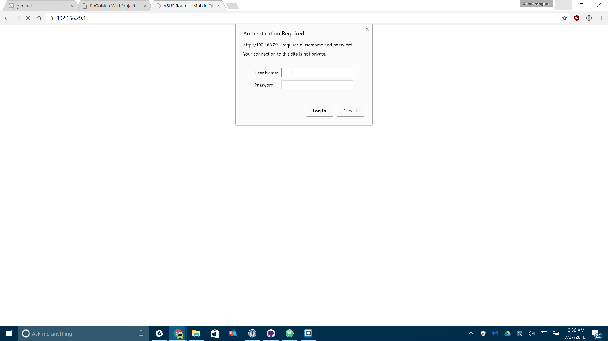
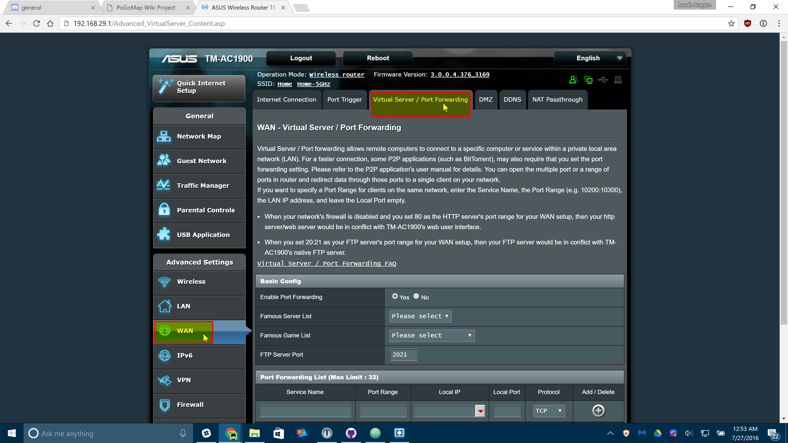
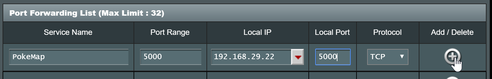

# External Access to Map

## Introduction

This guide will show you how to make your map available on the internet, including yourself on the go. These instructions should **not** be used on a server you are giving out to other people for use, as it is not the most secure option available. **We are not responsible for damage caused to your software, equipment, or anything else, proceed at your own risk.**

This guide will most likely not match your router exactly, as different manufacturers have different software and configuration. This is meant to be a general guide as many routers have a lot in common, but if you can't follow these following instructions, try Googling something like "Port forwarding [*MY ROUTER MODEL*]"

## Gathering Information

First we should find some information about your network. Press `Win`+`R` and type "cmd" on Windows to open a Command Prompt. On Linux and OS X, open a Terminal application.

On Windows, enter the following command:

```
ipconfig
```

On Linux and OS X, enter:

```
ifconfig
```

A lot of information will appear on your screen, but these two lines are what we're looking for:

```
IPv4 Address. . . . . . . . . . . : 192.168.29.22
Default Gateway . . . . . . . . . : 192.168.29.1
```

Obviously, your numbers (IP Addresses) will most likely look different from mine. Jot those two down so we can use them later.

Let's also find your Public IP address, browse to [mxtoolbox.com/whatismyip](http://mxtoolbox.com/whatismyip/) and note the IP Address it gives you there.

## Port Forwarding

Open an internet browser and type in the "Default Gateway" IP address we just found in the last step. It may ask you to login at this point, enter the login credentials for your router. It is important to note that this generally isn't your wifi password, if you don't know your router login credentials, they are usually on the bottom of the router unless they've already been changed.



Now you should be on the homepage of your router's configuration. Find the Port Forwarding section of your router. On mine it was under "WAN" > "Virtual Server / Port Forwarding" but yours may differ.



Enter the following information on that screen. Some routers may make you press a menu before you can see these text boxes:



Replace "Local IP" (sometimes called "Internal IP") with the IPv4 Address we found in the first step of this guide. Both port boxes should have the same number, 5000. If you only have one box for ports just enter "5000" in that one. Click the Add button to save your settings. If you have an option to choose from UDP or TDP, choose TDP.

## Finishing Up

Your port should now be added! Next time you start your server, add `-H 0.0.0.0` to the list of flags so it's accessible from the internet!

## Connecting

In any web browser not connected to your wifi, your phone for instance, browse to `http://11.22.33.44:5000/` **replacing** 11.22.33.44 with your external IP address, and you should be set!

**Note:** It is a known bug that Safari on iOS may not be able to load the map, if this happens to you download Chrome from the app store.