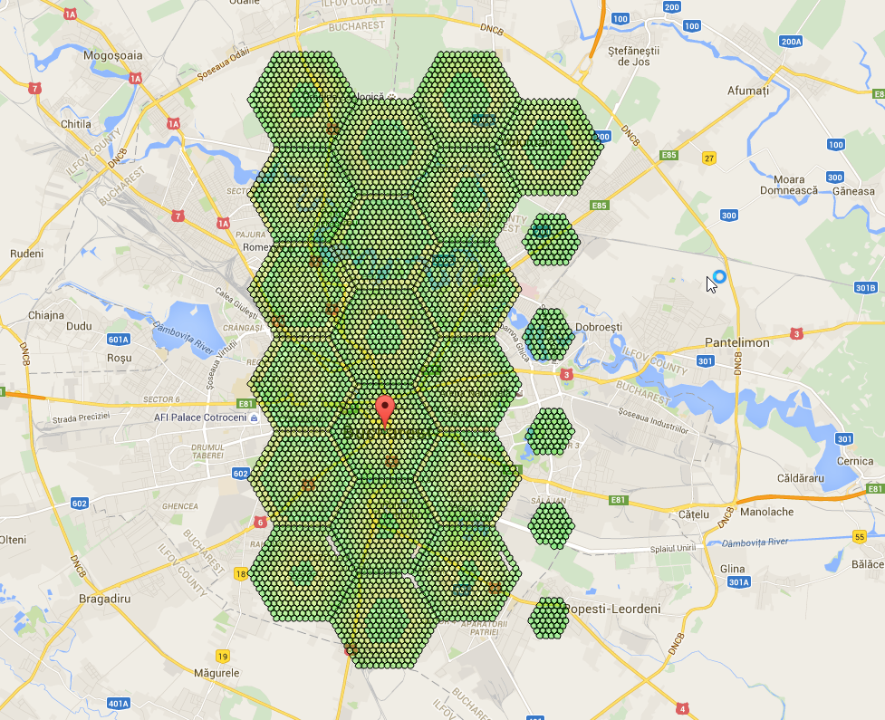
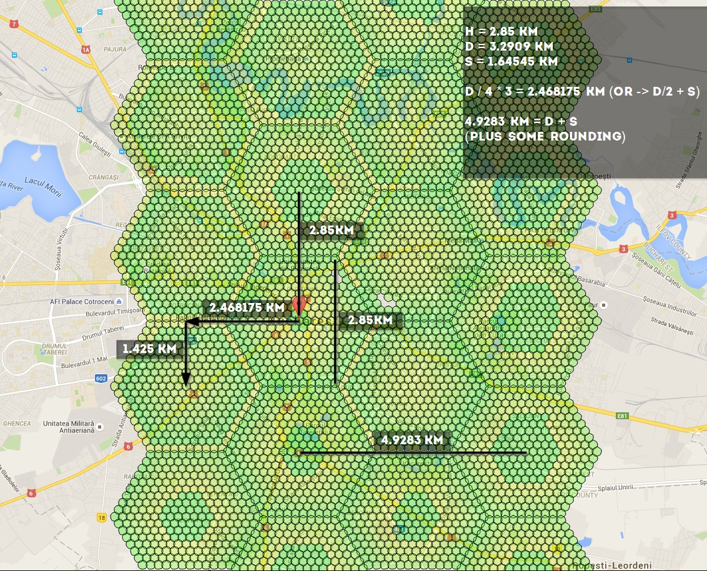

# Workers

(work in progress)

So, you want to do this:



 if using -st 10, these are the numbers you should know: 4.9283 km, 1.425 km, 2.468175 km, 2.85 km - you can use the distances to calculate coords here http://www.sunearthtools.com/tools/distance.php

Distances:



Link to figure out how to link all the hexagons together: http://goo.gl/X81fZq

contributed by olathurl from discord

## Here's a half-arsed implementation of reverse Haversine for you to finish off

It outputs the commands for scanning, and then prints the command to start the web server

```
# coding: utf8
import math

# Earth’s radius, sphere
R = 6378.1
username = "XXXXXX"
password = "XXXXXX"

cmd = "python runserver.py -ns -l '{lat} {lon}' --port {port} -u {username} -st 10 -p {password} &"
cmd_final = "python runserver.py -l '{lat} {lon}' -u {username} -st 10 -p {password} -st 10 -t 0 &"

# starting point
sham = (-33.8961, 151.1543)
lat = sham[0]
lon = sham[1]

# offsets in km
d = 2.85
brng = 90

# scan initial location
port = 6001
print cmd.format(lat=lat, lon=lon, port=port, username=username, password=password)

for i in range(5):
    port = port + 1
    # // Coordinate offsets in radians
    lat1 = math.radians(lat)  # Current lat point converted to radians
    lon1 = math.radians(lon)  # Current long point converted to radians

    lat2 = math.asin(math.sin(lat1) * math.cos(d / R) +
                     math.cos(lat1) * math.sin(d / R) * math.cos(brng))

    lon2 = lon1 + math.atan2(math.sin(brng) * math.sin(d / R) * math.cos(lat1),
                             math.cos(d / R) - math.sin(lat1) * math.sin(lat2))

    lat2 = math.degrees(lat2)
    lon2 = math.degrees(lon2)

    print cmd.format(lat=lat2, lon=lon2, port=port, username=username, password=password)

    lat = lat2
    lon = lon2


print cmd_final.format(lat=sham[0], lon=sham[1], username=username, password=password)
```